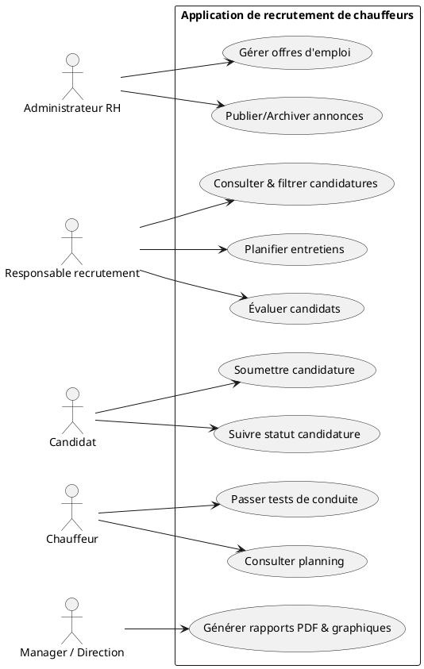
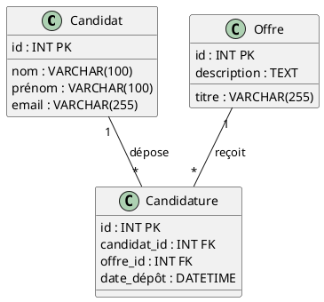
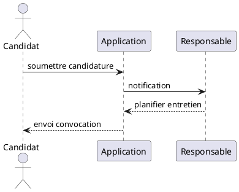

# Page de garde

<div align="center">
  
</div>

- **Nom complet de l’établissement :** l'Institut de Gestion Informatique et Commerciale (IGIC) Mohammedia
- **Titre du rapport :** Rapport de PFE – Application de recrutement de chauffeurs
- **Titre du projet :** Application de recrutement de chauffeurs
- **Auteur :** Salah ait hammou
- **Encadrant(s) :** Mohammed Ouggadi
- **Filière :** Développement Informatique
- **Année universitaire :** 2024-2025

## Remerciements

Il me tient à cœur d'exprimer ma gratitude à tous ceux qui ont contribué à la réussite de ce projet :

- **Les enseignants de l’IGIC** pour leur rigueur, leurs enseignements et leurs conseils qui m'ont permis d’acquérir les compétences nécessaires au développement de cette application.
- **M. Mohammed Ouggadi**, mon encadrant, pour son accompagnement bienveillant, ses retours constructifs et sa disponibilité tout au long de la réalisation.
- **Mes camarades de promotion** pour leur solidarité, les échanges d’idées et l’entraide durant les phases de conception et de tests.
- **Les chauffeurs et professionnels** ayant testé l’application, pour leurs précieux retours qui ont contribué à améliorer l’ergonomie et la fiabilité de l’outil.
- **L’administration de l’IGIC** pour la mise à disposition des infrastructures informatiques et des licences logicielles.
- **Ma famille et mes amis** pour leur soutien moral, leur patience lors des moments de travail intensif et leurs encouragements constants.

Je remercie enfin toutes les personnes qui, de près ou de loin, ont participé à ce projet de fin d’études et sans qui ce travail n’aurait pas pu voir le jour.

## Résumé

Le projet « Application de recrutement de chauffeurs » a pour objectif de concevoir une plateforme web permettant de centraliser et d’automatiser le processus de recrutement des chauffeurs. Basée sur Laravel 12 et PHP 8.2, l’application propose des fonctionnalités complètes : gestion des offres, des candidatures, des entretiens, des évaluations, des tests de conduite, ainsi que le suivi des absences et des congés. L’interface, développée avec TailwindCSS, Alpine.js et Vite, offre une expérience utilisateur fluide et réactive. La génération de rapports au format PDF (DOMPDF) et de graphiques dynamiques (Chart.js) facilite l’analyse des indicateurs clés. Les autorisations sont gérées via Spatie Permission pour assurer la sécurité et la confidentialité des données.

La méthode a consisté en une architecture MVC standard, l’utilisation de FormRequests pour la validation, et la mise en place de tests PHPUnit pour garantir la fiabilité. Les résultats démontrent une réduction significative du temps de traitement des candidatures et une meilleure traçabilité des processus RH.

## Abstract

The “Driver Recruitment Application” project aims to develop a web platform that centralizes and automates the driver recruitment workflow. Built with Laravel 12 and PHP 8.2, the system offers full features: job post management, candidate tracking, interview scheduling, evaluations, driving tests, and leave management. The front-end, implemented using TailwindCSS, Alpine.js, and Vite, delivers a smooth and responsive user experience. PDF report generation (DOMPDF) and dynamic charts (Chart.js) assist in monitoring key performance metrics. Access control is enforced via Spatie Permission to protect sensitive data.

The approach followed a conventional MVC pattern, leveraging FormRequests for input validation and PHPUnit tests for reliability. Results show a marked decrease in application processing time and improved HR process traceability.

## 1. Introduction générale

### 1.1 Contexte général

Le recrutement de chauffeurs est un processus complexe et crucial pour les entreprises de transport, qui nécessite une grande rigueur et une gestion efficace des ressources humaines. Dans ce contexte, l’application de recrutement de chauffeurs a été conçue pour répondre aux besoins spécifiques des entreprises de transport et améliorer la gestion du processus de recrutement.

### 1.2 Objectifs du projet

- Centraliser toutes les étapes du recrutement des chauffeurs sur une plateforme unique.
- Automatiser les tâches répétitives (envoi d’invitations, génération de rapports).
- Améliorer la traçabilité et le suivi des candidatures.
- Offrir une interface utilisateur réactive et conviviale.
- Générer des rapports PDF et des graphiques pour faciliter la prise de décision.

### 1.3 Structure du rapport

Le rapport est structuré en six chapitres :
1. **Introduction générale** (contexte, objectifs, structure)
2. **Étude préliminaire / Analyse du besoin** (problématique, étude du domaine, besoins utilisateurs)
3. **Analyse fonctionnelle et technique** (cahier des charges, modélisation)
4. **Conception et architecture** (diagrammes, choix technos)
5. **Implémentation et tests** (détails techniques, captures d’écran)
6. **Conclusion et perspectives**

## 2. Étude préliminaire / Analyse du besoin

### 2.1 Problématique

Le recrutement de chauffeurs constitue un enjeu stratégique pour les entreprises de transport, qui doivent identifier rapidement et efficacement des candidats qualifiés afin d’assurer la continuité et la qualité de leurs services. Or, dans la plupart des structures, ce processus repose encore sur des méthodes manuelles et dispersées : envoi d’emails, tableurs Excel et formulaires papier, sans plateforme centralisée.

Cette fragmentation des outils entraîne plusieurs difficultés :
- **Visibilité limitée** : les responsables ne disposent pas d’un suivi global en temps réel du parcours des candidats (étapes de présélection, entretiens, tests de conduite, etc.).
- **Gestion asynchrone des échanges** : la multiplication des canaux (email, téléphone, papier) entraîne un volume de messages non structurés, qui complexifie la prise de décision et expose à des erreurs ou des doublons.
- **Traçabilité insuffisante** : l’historique des interactions et des décisions n’étant pas centralisé, il est difficile d’analyser et d’améliorer le processus de recrutement sur le long terme.
- **Absence de reporting** : sans outil de génération de statistiques (taux de conversion, délais moyens, origines des candidatures), les décideurs ne peuvent pas piloter ni optimiser leur stratégie RH.

Face à ces enjeux, il est indispensable de mettre en place une solution intégrée capable de structurer, d’automatiser et de sécuriser l’ensemble du workflow de recrutement des chauffeurs, en garantissant réactivité, fiabilité et conformité aux règles de confidentialité.

### 2.2 Étude du domaine

L'industrie du transport routier repose sur divers opérateurs (entreprises de transport de voyageurs, de marchandises, services de VTC, gestionnaires de flottes). Chaque acteur fait face à des problématiques spécifiques : pénurie de main-d’œuvre qualifiée, respect des normes de sécurité, optimisation des plannings et maîtrise des coûts opérationnels.

Les outils existants :
- **Portails d'emploi en ligne** : centralisent les annonces mais offrent un suivi limité.
- **SIRH/ATS** : solutions globales souvent coûteuses et peu adaptées aux spécificités du transport.
- **Outils internes** : tableurs et bases de données maison, sans ergonomie ni reporting avancé.

Réglementations et normes :
- Permis professionnels (C, D, E) et formation continue (FIMO, FCO).
- Respect des temps de conduite et de repos (réglementation européenne).

Bonnes pratiques :
- Automatisation des notifications et rappels.
- Reporting en temps réel des indicateurs clés (taux de conversion, délai moyen de recrutement).
- Intégration des tests pratiques et évaluations pour valider les compétences.

### 2.3 Analyse des besoins utilisateurs

- **Administrateur RH :** gérer les offres d’emploi (création, modification, suppression) et les profils des utilisateurs.
- **Responsable recrutement :** consulter et filtrer les candidatures, planifier les entretiens et évaluer les candidats.
- **Candidat :** soumettre sa candidature en ligne, suivre l’état d’avancement de son dossier et accéder aux notifications.
- **Chauffeur (utilisateur interne) :** passer des tests de conduite, recevoir des convocations et consulter son planning.
- **Manager / Direction :** générer des rapports PDF et graphiques pour le suivi des indicateurs RH.

### 2.4 Objectifs du projet

- Centraliser toutes les étapes du recrutement des chauffeurs sur une plateforme unique.
- Automatiser les tâches répétitives (envoi d’invitations, génération de rapports).
- Améliorer la traçabilité et le suivi des candidatures.
- Offrir une interface utilisateur réactive et conviviale.
- Générer des rapports PDF et des graphiques pour faciliter la prise de décision.

### 2.5 Cahier des charges

#### 2.5.1 Exigences fonctionnelles

- **FR1 – Offres d’emploi** : création, modification, suppression, publication et archivage des annonces.
- **FR2 – Candidatures** : dépôt en ligne, gestion des pièces jointes (CV, lettre de motivation), suivi de statut et notifications.
- **FR3 – Entretiens** : planification automatisée, envoi de convocations et enregistrement des retours d’évaluation.
- **FR4 – Tests de conduite** : organisation des sessions de tests, notation standardisée et historique des résultats.
- **FR5 – Absences & congés** : demandes, approbation, mise à jour du calendrier partagé.
- **FR6 – Reporting & tableaux de bord** : génération de rapports PDF, graphiques dynamiques et export de données (CSV/Excel).

#### 2.5.2 Exigences techniques

- **TR1 – Back-end** : Laravel 12 (PHP 8.2), architecture MVC et FormRequests pour la validation.
- **TR2 – Base de données** : MySQL 8, migrations, seeders et optimisation par indexation.
- **TR3 – Front-end** : TailwindCSS v3, Alpine.js et Vite pour un build performant et design responsive.
- **TR4 – Authentification & autorisation** : Laravel Sanctum et Spatie Permission pour la gestion des rôles et permissions.
- **TR5 – Génération de documents** : DOMPDF pour PDF, Chart.js pour graphiques dynamiques et exports CSV.
- **TR6 – Tests & CI/CD** : PHPUnit pour tests unitaires et fonctionnels, GitHub Actions pour pipeline CI.
- **TR7 – Sécurité & conformité** : bonnes pratiques OWASP, protection CSRF/XSS, validation server-side et RGPD.

#### 2.5.3 Exigences non-fonctionnelles

- **NFR1 – Performance** : temps de réponse < 2s pour les pages critiques, mécanismes de cache.
- **NFR2 – Disponibilité & scalabilité** : conteneurisation Docker, déploiement horizontal et gestion des sessions.
- **NFR3 – Maintenabilité** : PSR-4, code modulaire, documentation Swagger ou L5-Swagger.
- **NFR4 – Portabilité** : déploiement sur différents environnements (local, production, Docker).
- **NFR5 – Documentation** : manuel utilisateur, documentation API et diagrammes UML.

### 2.6 Contraintes

#### 2.6.1 Contraintes fonctionnelles

- **CF1 – Disponibilité** : service accessible 24/7 pour les utilisateurs.
- **CF2 – Réactivité** : interface responsive (desktop, tablet, mobile).
- **CF3 – Multilingue** : prise en charge du français et de l’anglais.
- **CF4 – Interopérabilité** : intégration avec les services de messagerie et calendriers externes.

#### 2.6.2 Contraintes techniques

- **CT1 – Environnement** : hébergement sur serveur Linux (PHP 8.2, MySQL 8).
- **CT2 – Conteneurisation** : utilisation de Docker pour développement et production.
- **CT3 – Sauvegardes** : backups automatiques quotidiens de la base de données.
- **CT4 – Performance** : temps de réponse < 2s pour les pages critiques.
- **CT5 – Sécurité** : conformité OWASP, protection CSRF/XSS et RGPD.

## 3. Conception

### 3.1 Diagramme de cas d’utilisation

+Le diagramme ci-dessous présente les principaux acteurs et leurs interactions au sein de l’application.



#### 3.2.2 Modèle Logique de Données (MLD)



### 3.3 Diagrammes d’activités & de séquence

#### 3.3.1 Diagramme d’activité (Processus de recrutement)

```plantuml
@startuml
start
+:Soumettre candidature;
+:Vérification automatique;
+if (valid?) then (oui)
+  :Planifier entretien;
+else (non)
+  stop
+endif
+stop
@enduml
```

#### 3.3.2 Diagramme de séquence (Soumission de candidature)



### 3.4 Architecture de l’application

L’architecture suit le pattern MVC de Laravel. Les requêtes HTTP transitent par le routeur, traversent le Kernel et les middleware, sont traitées par les Controllers, manipulent les Models via Eloquent et retournent des Views (Blade). Les validations sont gérées par des FormRequests, et les dépendances sont résolues par le conteneur IoC.

#### 3.4.1 Pattern MVC

- **Models** : `app/Models`, représente la couche d’accès aux données (Eloquent).
- **Views** : `resources/views`, templates Blade pour le rendu HTML.
- **Controllers** : `app/Http/Controllers`, orchestrent la logique métier.

```php
// Exemple de controller
namespace App\Http\Controllers;
use App\Models\Candidature;
use App\Http\Requests\StoreCandidatureRequest;
class CandidatureController extends Controller
{
    public function store(StoreCandidatureRequest $request)
    {
        Candidature::create($request->validated());
        return redirect()->route('candidatures.index');
    }
}
```

#### 3.4.2 Routes Laravel

Les routes sont définies dans `routes/web.php`. Exemple :

```php
Route::middleware(['auth'])->group(function () {
    Route::resource('candidatures', CandidatureController::class);
});
```

#### 3.4.3 Conteneur IoC / Service Container

Laravel utilise un conteneur d’inversion de contrôle pour injecter automatiquement les dépendances dans les Controllers, Services ou autres classes, via le constructeur ou les méthodes.

#### 3.4.4 Middleware

Les middleware (`app/Http/Middleware`), enregistrés dans `app/Http/Kernel.php`, filtrent les requêtes avant et après le controller (ex. `auth`, `verified`).

#### 3.4.5 FormRequests

Les FormRequests (`app/Http/Requests`) centralisent la validation et l’autorisation des requêtes HTTP, remplaçant la validation inline dans les controllers.

### 3.5 Technologies utilisées

- Laravel 12 (PHP 8.2)
- MySQL 8
- Blade (templating)
- TailwindCSS v3, Alpine.js, Vite
- DOMPDF, Chart.js
- Spatie Permission, Laravel Sanctum
- PHPUnit, GitHub Actions (CI/CD)

## 4. Développement de l’application

### 4.1 Environnement de développement

- **IDE** : Visual Studio Code (extensions PHP Intelephense, Laravel Snippets, Blade Syntax)
- **Serveur local** : XAMPP (Apache, MySQL 8, PHP 8.2)
- **Gestion des dépendances PHP** : Composer
- **Gestion des assets front-end** : Node.js & NPM (Vite, TailwindCSS, Alpine.js)
- **Contrôle de version** : Git & GitHub

## 4.2 Fonctionnalités principales

- **4.2.1 Gestion des offres d’emploi** :
  - Création, modification, suppression, publication et archivage d’annonces.
  - Liste paginée avec filtres (statut, date, mots-clés) et recherche libre.
  - Gestion des pièces jointes (documents, images du poste).

- **4.2.2 Gestion des candidatures** :
  - Dépôt en ligne avec upload de CV et lettre de motivation.
  - Suivi des statuts (reçu, en cours, retenu, refusé) avec journaux d’historique.
  - Notifications automatiques (email/SMS) à chaque évolution de statut.

- **4.2.3 Gestion des entretiens** :
  - Planification via calendrier intégré et lien de visio si applicable.
  - Envoi de convocations et rappels par email/SMS.
  - Saisie de feedbacks, notation et archivage des comptes-rendus.

- **4.2.4 Évaluations et tests** :
  - Création de grilles d’évaluation personnalisables (compétences, soft skills).
  - Suivi des résultats théoriques et pratiques, génération de rapports.
  - Historique des évaluations et comparaison des candidats.

- **4.2.5 Tests de conduite** :
  - Programmation des sessions avec lieux, véhicules et instructeurs.
  - Enregistrement des résultats selon des critères standardisés.
  - Gestion des validations, certificats et renouvellements.

- **4.2.6 Gestion des absences et congés** :
  - Demande de congé via formulaire dédié et workflow d’approbation.
  - Calendrier partagé multi-utilisateurs pour visualiser les plannings.
  - Notifications et rappels pour gestionnaires et employés.

- **4.2.7 Reporting et tableaux de bord** :
  - Génération de rapports PDF personnalisés (taux de conversion, délais moyens).
  - Tableaux de bord interactifs avec Chart.js et export CSV/Excel.
  - Planification d’envois automatiques de rapports périodiques.

## 4.3 Interfaces utilisateur

### 4.3.1 Tableau de bord


### 4.3.2 Gestion des offres d’emploi


### 4.3.3 Formulaire de candidature


### 4.3.4 Planning des entretiens


